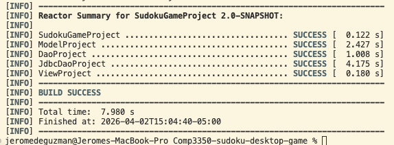
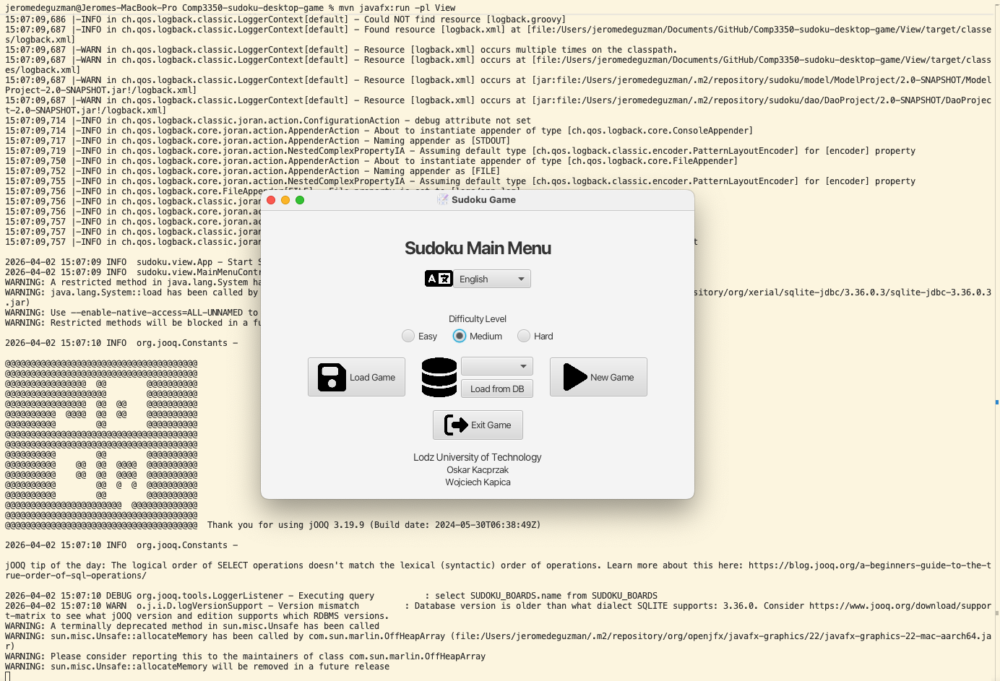
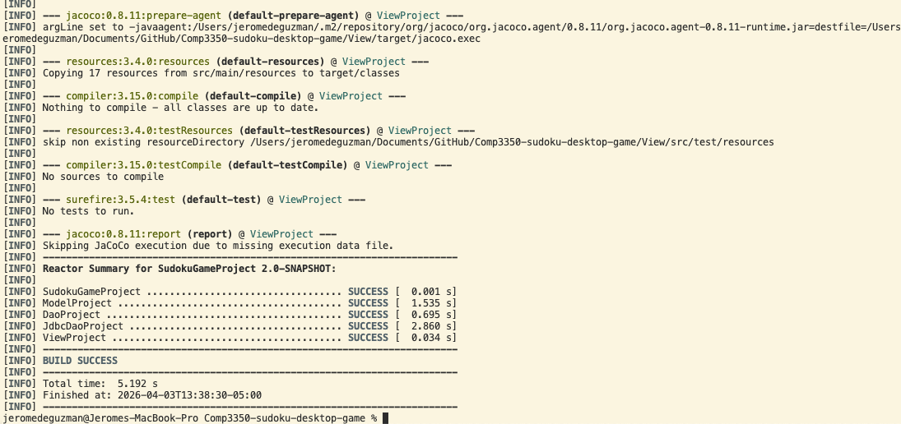
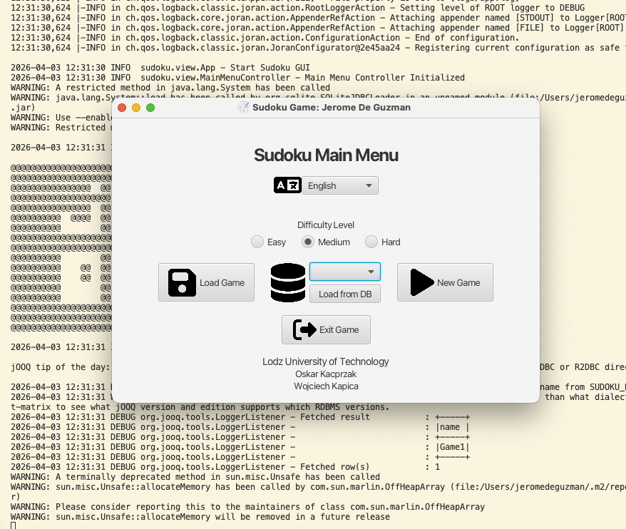
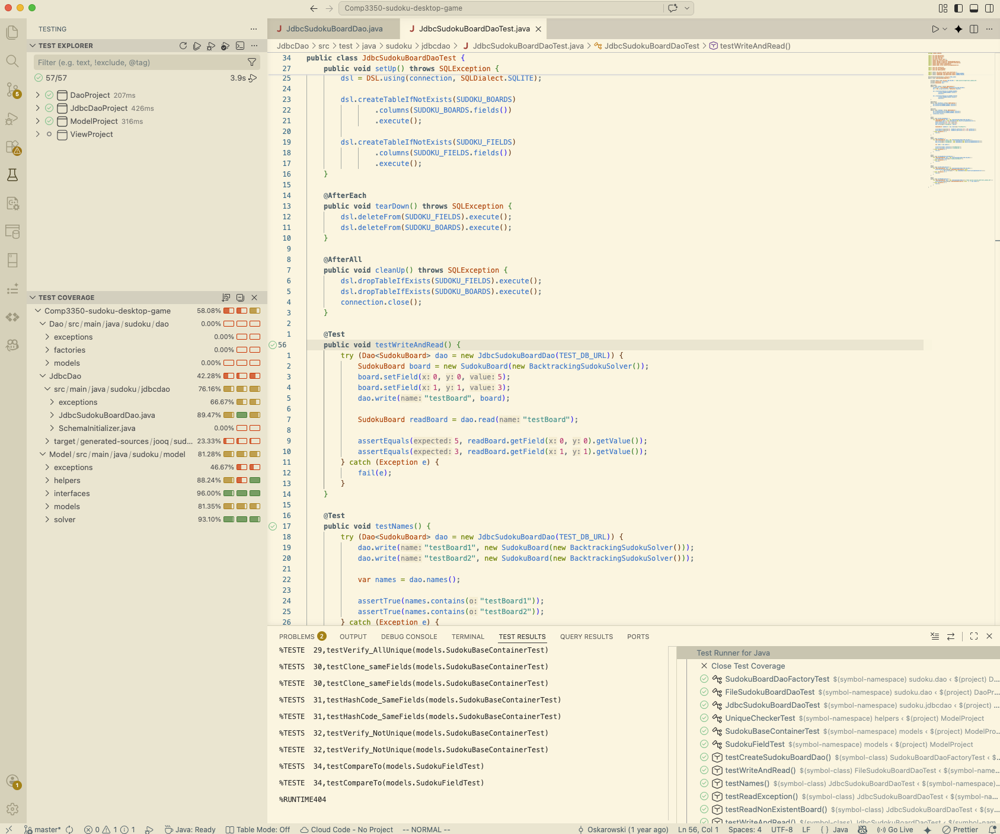

# Maintaining a Legacy System

We have been instructed to maintain a legacy system that we are not familiar with, we must get a clear understanding of the legacy system as a whole to be able to work and add implementation to the system effectively.

## 1. Getting the System Running (Field Notes + Reflections)

Our task is to build and run the system from source.

### Report
Build and run the system from source.

In your report, describe:
- The environment you used (Java version, IDE, OS).
- The steps you took to get the system running.
- Any build errors or dependency/configuration issues encountered.
- How you diagnosed and resolved issues.
- Your overall approach (trial-and-error, reading build files, searching for entry points, inspecting package structure, etc.).

This section should read like professional onboarding notes. Reflect on what you tried, what worked, and what you learned about the codebase from the setup process.

Evidence:
- Screenshot showing the application successfully running.
- Screenshot showing a successful build and/or successful test execution.

#### Environment used: (Java version, IDE, OS)
- Java version: 25.0.1, Although Java 21 is minimum version needed
- Java runtime environment: (build 25.0.1+8-LTS-27)
- IDE: Visual Studios: 1.112.0
- OS: OSX (MacOS): Sequoia 15.4.1

#### Steps to get the system running:

There are immediately errors after forking this codebase; there are undefined methods, variables, and imports; methods that need to be overridden or create implementation; and wrong parameter arguments that need to be handled before being able to build initally.

Following the legacy systems documentation instructions for installation and running, we can see we run into a dependency issue. That is, we need to have maven installed on our system.

Thus, one of the first things we must do is install maven:
```bash
brew install maven
```

Now we try to run the command:
```bash
mvn install
```

After running, we can see we were not able to have some symbols recognized because we were building with JOOQ since there was no explicit version created, we defaulted to 3.21.1. The build error said there was an error building JdbcDao with the mismatched dependencies version, so I went into the pom.xml file inside the JdbcDao directory and realized that jooq was there, but the specific version was not explicitely stated. So I added it in with the explicit version required that matches the DefaultCatalog.java and Constants.java files JOOQ version support.

Initalially, I had issues with figuring out which pom.xml file to change, but realized that the specific module that had the issue was within JdbcDao. From there I was able to find the pom.xml, added the explicit version requirement and tried to build again, and it worked.

I almost went down the route of thinking the code itself has issue, but after experiencing Comp 3350, Software Engineering, I realized that it could be build issues. As I have seen with other groups have issues with their gradle dependencies.

Now our build runs successfully:


**Figure 1: Successful Build**

Thus, we move forward with the installation guide.

We run the code:
```bash
mvn javafx:run -pl View
```


**Figure 2: Successful Application**


**Figure 3: Successful Tests**

As we can see, the application has both been succesfully built and run, with the testings as well, with no issues.

--- 

## 2. Understanding the System (In Your Own Words)

### Report:
- What problem does it solve?
- What are its major features?
- How does a user interact with it?

Your explanation should demonstrate understanding, not copy documentation.

**Name-in-UI requirement:**
- Modify a visible label, heading, or title in the application to include your name.
- Include a screenshot proving your modification works.
  

#### What problem does it solve?
The application solves the problem of user boredom, allowing them to pass the time with something fulfilling and mentally challening. Sudoku, has been shown in studies to be a [good cognitive stimulating leisure-time activity.](https://pmc.ncbi.nlm.nih.gov/articles/PMC7718610/) (Ashlesh et al., 2020).


#### What are its major features?
There are a few major features:
- Saving game: internally (SQLite) and externally (file)
- Changing Language: (English and Polish)
- 3 Difficulties: (Easy, Medium, and Hard)

#### How does a user interact with it?
The user interacts with the application with the front-end given by JavaFX. The front-end has buttons, drop down menus, radio buttons for control, and an editable text box for the actual grid pieces of the sudoku.

### Name-in-UI requirement:
- Modify a visible label, heading, or title in the application to include your name.
- Include a screenshot proving your modification works.


**Figure 4: Name-in-UI**

Here in figure 3, we can see that I was able to change the title from 'Sudoku Game' to 'Suudoku  Game: Jerome De Guzman'. 

---

## 3. Architecture Exploration and Reflection

### Report
- Describe the architectural style (if any) that appears to be present (e.g., layered, MVC).
- How are responsibilities divided across packages/classes?
- Is there separation between UI and logic? Provide examples.
- Where is coupling high? Provide at least one specific example (class names + what depends on what).
- Where is cohesion strong or weak? Provide at least one specific example.

Reflect on whether the architecture makes maintenance easier or harder. Support your claims with specific evidence from the codebase (file names, class names, call chains, screenshots, diagrams, etc.).

#### Describe the architectural style (if any) that appears to be present (e.g., layered, MVC).
The application follows a Model View Controller (MVC) architectural pattern. It also has a layered type of architecture for the data access which separates the service/logic layer from the persistence depending on which one you use. That is either the file system or the JDBC.


#### How are responsiblilities divide across packages/classes
- Dao / JdbcDao: these modules are for handling persistence for the application.
  - Dao: provides interace and specific implementation for file system storage
  - JdbcDao: provides a specific implementation for SQLite using te jOOQ library.
- Model: Is used for the different models, such as SudokuBoard and SodukuField. This module also handles the bulk of the core business logic.
- View: Contains the code for handling the front-end work, this is where the JavaFX gui code lies, logic, the XML layouts, and others.

*Side Note: This isn't anything too important, but it is pretty funny to me. When I was initally looking over the codebase, I was confused with why the directory names was Dao and JdbcDao. I thought, the native language of the author was Polish, with support for English, how do they know a different language... I just realized now what it means.*

#### Is there separation between UI and logic? Provide examples.
We can see in the codebase, that there is a strong separation between the UI and logic layers. This is apparent when we see the different modules, that there is no dependencies on each other. For example, the Model module has no dependencies on JavaFX which means we could switch out the UI layer for something else and should have little to no issues. Another example is that the validation for the sudoku board is handled by the logic layer rather than being in the UI layer and then passed on to logic layer.

#### Where is coupling high? Provide at least one specific example (class names + what depends on what).
There is one specific example that we can see has high coupling, that is in the SudokuBoardDaoFactory class. The class is coupled to the other files within this module, that is the file FileSudokuBoardDao and the database JdbcSudokuBoardDao files to instantiate them. We can see the example in the createJdbcSudokuBoardDao function where the jdbcdao is coupled.


#### Where is cohesion strong or weak? Provide at least one specific example.
I can do two exmples for the cohesion, since it also gives me a good understanding of this concept.

**Strong Cohesion:**
The SudokuBoard class has strong cohesion, since all the functions contained within are closely related to focus on the of the class as a whole. That is to handle the SudokuBoard, it has well-defined responsibilities. Such as, initalizing the SudokuBoard, getting the entry within the board, setting the entry within the board, other getters and setters, solveGame, validation for valid Sudoku, and etc.

**Weak Cohesion:**
The SudokuBoardDaoFactory class has low cohesion since it handles both the mapping of the objects to the database records and handling the database connection, which are two different responsiblities with mapping and connection management.

---

## 4. Testing and Build State (Automated Test Required)

### Report
- Are tests present in the repository?
- If yes, were they runnable? Where do they live and what do they test?
- If not, what does that suggest about maintainability and risk?
  
Run the tests (if present) and include evidence of success or failure. You may comment on coverage reports if available (and what the coverage does or does not imply)

**Required: Implement one automated test (JUnit preferred).**

In your report, explain: 
- What you chose to test and why.
- Whether your test is a unit test or an integration test (and why).
- If refactoring was required to enable testability (describe what changed and why).
- Where the test file lives in the project structure (e.g., src/test/java/...).


#### Are tests present in the repository?
There are tests present in the repository. They are in an automated test suite.

#### If yes, were they runnnable? Where do they live and what do they test?
The tests are runnable, you can either use the Maven command 'mvn test' or what I did to have a more definitive confirmation of tests running, is to run each of the tests files. This way I was also able to get better understanding on where these tests are located. 

Theses tests are located within their own respective modulars, given the MVC architecture style used. There is a directory for thoses test that follow the following directory path `<MVC-DIRECTORY>/src/test/java`. 

There are unit test using JUnit for automated tests, that test the core implementations classes functionality. For example, the JdbcSudokuBoardDaoTest.java tests its respective .java class file counterpart, that is the JdbcSudokuBoardDao.java file. Ensuring that the SQLite databases functionality is working according with tests, such as, setUp, tearDown, cleanUp, testWriteAndRead, testNames, and etc.

There are also coverage reports that I have found. For example, the JdbcDao module has JaCoCo (Java Code Coverage) reports located in their respective `target/site/jacoco` directories. This allows us to use Test Runner for Java extension in Visual Studios to see the coverage report produced.


#### If not, what does that suggest about maintainability and risk?
If there were no tests created, then that would create a big issue when it comes to the maintainability of a system over time, especially once it becomes a legacy system. The risk would be that any little change to the implementation would cause a doubt on the developer, implementing them. Since without tests, they do not have any deterministic guarantee that their implementation/refactoring works, without affecting the whole systems behaviour as a whole. This can also cause hidden issues which can be quite difficult to identify and bugs that can slowly permeate as more implementation happens, leading to a fragile codebase.

#### Running tests

**Figure 5: Jacoco Coverage Report**

As we can see, the figure above shows the Jacoco coverage report for the tests, we can run tests using the command palette in Visual Studios, running the command `Java: Run Test`, or `Test: Run All Tests`, or using the Test Runner for Java extension and clicking play. We can also right click on the play button with the circular white check mark with a black background icon, to run the tests with coverage.

### Implement one automated test

#### What you chose to test and why
I chose to test the names() function, that focuses the accuracy and handling edge cases.

We test on the empty state while technically excluding the '.gitkeep' name within. Since it is not part of the section 4 instructions, to explicitly change code implementation, just so that we could have a completely empty state. Thus, we adjusted our testing to account for that factor. We also tested to make sure that writes are correct and appear in the list as they exactly were. We also tested the size integrity of making sure that the names we added are taken account of.

##### Whether your test is a unit test or an integration test (and why)
The test written would be classified as an integration test because of the fact that we are actually using the actual disk or file system that is implemented within what we're testing and we aren't mocking the behaviour like what is done for unit tests. The test was written this way so that we can properly test the behaviour of the system, creating a mock/unit test would essentially defeat the purpose of the test written.

#### If the reactoring was required to enable testability (describe what changed and why).

#### Where the test file lives in the project structure (e.g., src/test/java/...)


---

# References
Ashlesh, P., Deepak, K. K., & Preet, K. K. (2020). Role of prefrontal cortex during Sudoku task: fNIRS study. Translational neuroscience, 11(1), 419–427. https://doi.org/10.1515/tnsci-2020-0147